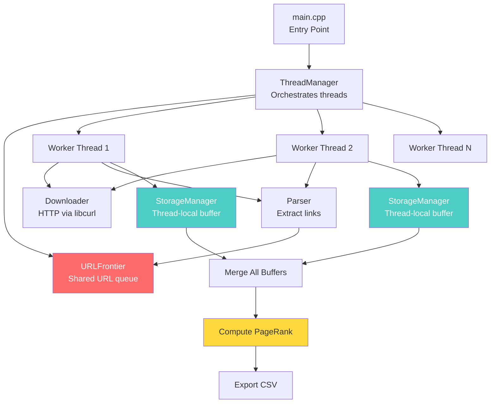
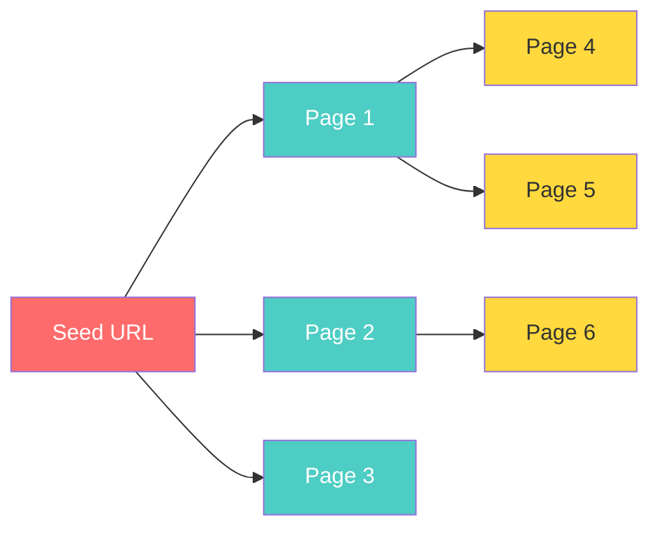
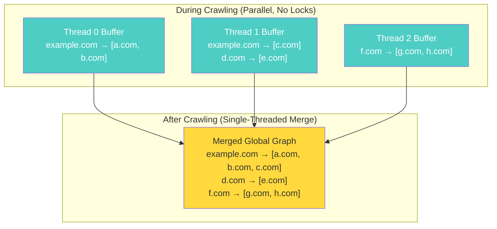
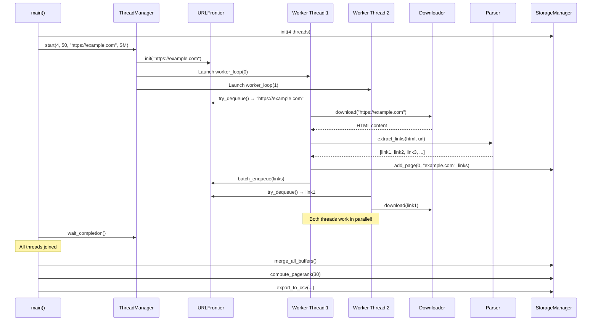

# 🕷️ Deep Dive: Multithreaded Web Crawler

A complete learning guide — covering **what the project does**, **the theory behind every concept**, and **how the code implements it**.

---

## 1. What Is a Web Crawler?

A **web crawler** (also called a spider or bot) is a program that automatically browses the internet by:

1. Starting from a **seed URL** (e.g., `https://example.com`)
2. **Downloading** the HTML of that page
3. **Parsing** the HTML to find all hyperlinks (`<a href="...">`)
4. Adding those new links to a **queue** of pages to visit
5. **Repeating** steps 2–4 until a stopping condition is met (e.g., max pages reached)

> [!NOTE]
> This is exactly how Google's search engine works at its core — Googlebot crawls the web, discovers pages, and indexes them. This project is a simplified version of that idea.

### Real-World Analogy
Imagine you're in a library. You pick up a book (seed URL), read it, and note down every other book it references. Then you go find those books, read them, note down their references, and so on. You stop when you've read enough books (max pages).

---

## 2. Why Multithreading?

### The Problem with Single-Threaded Crawling

Downloading a web page involves **network I/O** — your program sends a request and then **waits** for the server to respond. This waiting time (called **latency**) is typically 50–500ms per page. A single-threaded crawler would:

```
Download page 1 → wait 200ms → Parse → Download page 2 → wait 200ms → Parse → ...
```

For 100 pages at 200ms each, that's **20 seconds just waiting**.

### The Multithreaded Solution

With multiple threads, while **Thread 1** is waiting for a response, **Thread 2, 3, 4** can be downloading other pages simultaneously:

```
Thread 1: Download A → wait... → Parse A → Download E → wait...
Thread 2: Download B → wait... → Parse B → Download F → wait...
Thread 3: Download C → wait... → Parse C → Download G → wait...
Thread 4: Download D → wait... → Parse D → Download H → wait...
```

This is called **concurrency** — overlapping work to reduce total time.

> [!IMPORTANT]
> **Key Theory: Threads vs Processes**
> - A **process** is an independent program with its own memory space.
> - A **thread** is a lightweight unit of execution *within* a process. Threads share the same memory space, which makes sharing data (like the URL queue) easy but also dangerous (race conditions).

---

## 3. The Concurrency Challenge: Why "Lock-Free" Matters

### Race Conditions

When multiple threads access the same data simultaneously, you get **race conditions**. Example:

```
Thread 1 reads counter = 5
Thread 2 reads counter = 5
Thread 1 writes counter = 6
Thread 2 writes counter = 6   ← WRONG! Should be 7
```

### Traditional Solution: Mutexes (Locks)

A **mutex** (mutual exclusion) is like a bathroom lock — only one thread can "hold" it at a time. Others must wait. This is **correct** but **slow** because:
- Threads spend time waiting for the lock (**contention**)
- The CPU can't do useful work while a thread is blocked

### This Project's Approach: Minimize Locking

This project uses a clever **hybrid strategy**:

| Technique | Where Used | How It Works |
|---|---|---|
| **Mutex** | URL queue only ([url_frontier.cpp](file:///d:/ANTIGRAVITY%20TESTS/GOOGLE%20Projects/MultiThreaded%20Web%20Crawler/multithreaded-web-crawler/src/url_frontier.cpp)) | A single `std::mutex` protects the shared queue. This is unavoidable — the queue is inherently shared. |
| **Thread-Local Buffers** | Domain graph storage ([storage_manager.cpp](file:///d:/ANTIGRAVITY%20TESTS/GOOGLE%20Projects/MultiThreaded%20Web%20Crawler/multithreaded-web-crawler/src/storage_manager.cpp)) | Each thread writes to its **own private buffer**. No locks needed! Buffers are merged after crawling ends. |
| **Atomic Variables** | Page counter ([thread_manager.h](file:///d:/ANTIGRAVITY%20TESTS/GOOGLE%20Projects/MultiThreaded%20Web%20Crawler/multithreaded-web-crawler/include/thread_manager.h#L47-L48)) | `std::atomic<int>` allows lock-free increment/read. The CPU guarantees atomicity at the hardware level. |

> [!TIP]
> **Why this is smart**: The most expensive operation (building the domain graph) is completely lock-free. Only the lightweight URL queue requires a lock. This is a textbook example of **reducing lock scope** to improve throughput.

---

## 4. Architecture Overview

Here's how all the components fit together:



---

## 5. Component-by-Component Breakdown

### 5.1 `main.cpp` — The Conductor

**File**: [main.cpp](file:///d:/ANTIGRAVITY%20TESTS/GOOGLE%20Projects/MultiThreaded%20Web%20Crawler/multithreaded-web-crawler/src/main.cpp)

This is the entry point. It orchestrates the entire pipeline in 4 phases:

```
Phase 1: Validate Inputs (seed URL, max pages, thread count)
Phase 2: Crawl (multithreaded download + parse)
Phase 3: Merge + Compute PageRank (single-threaded, post-crawl)
Phase 4: Export Results to CSV
```

**Key detail**: Each phase is **timed** using `std::chrono::high_resolution_clock` so you can see exactly how long crawling vs. PageRank computation takes.

---

### 5.2 `ThreadManager` — The Thread Pool

**Files**: [thread_manager.h](file:///d:/ANTIGRAVITY%20TESTS/GOOGLE%20Projects/MultiThreaded%20Web%20Crawler/multithreaded-web-crawler/include/thread_manager.h) · [thread_manager.cpp](file:///d:/ANTIGRAVITY%20TESTS/GOOGLE%20Projects/MultiThreaded%20Web%20Crawler/multithreaded-web-crawler/src/thread_manager.cpp)

#### Theory: Thread Pool Pattern

Instead of creating/destroying threads for every task, a **thread pool** creates a fixed number of threads upfront and keeps them alive. Each thread runs a **worker loop** that continuously pulls work from a shared queue.

#### How it works in code:

```cpp
// Create N worker threads, each running worker_loop()
for (int i = 0; i < num_threads; i++) {
    workers.emplace_back(&ThreadManager::worker_loop, this, i, 
                         std::ref(storage_manager));
}
```

Each worker thread runs this loop:

```
while (pages_crawled < max_pages) {
    1. Try to dequeue a URL from the frontier
    2. If got one → download → parse → store → enqueue new URLs
    3. If queue empty → exponential backoff (sleep 10ms, 20ms, 40ms, ...)
}
```

#### Theory: Exponential Backoff

When the queue is empty, threads don't spin wildly checking it (which wastes CPU). Instead, they **sleep for increasing durations**: 10ms → 20ms → 40ms → ... → 500ms max. This is called **exponential backoff** — a common strategy to reduce CPU waste during idle periods.

```cpp
if (backoff_ms < 500) {
    backoff_ms *= 2;  // Double the wait time
}
std::this_thread::sleep_for(std::chrono::milliseconds(backoff_ms));
```

The backoff **resets to 10ms** when the thread successfully gets a URL, so it stays responsive when there's work to do.

#### Progress Monitor

A separate **detached thread** prints progress every second:
```
[PROGRESS] Pages: 35/100 | Queue: 142 | Visited: 210
```

---

### 5.3 `URLFrontier` — The Shared Work Queue

**Files**: [url_frontier.h](file:///d:/ANTIGRAVITY%20TESTS/GOOGLE%20Projects/MultiThreaded%20Web%20Crawler/multithreaded-web-crawler/include/url_frontier.h) · [url_frontier.cpp](file:///d:/ANTIGRAVITY%20TESTS/GOOGLE%20Projects/MultiThreaded%20Web%20Crawler/multithreaded-web-crawler/src/url_frontier.cpp)

#### Theory: BFS (Breadth-First Search) on the Web

The URL frontier is essentially performing a **BFS traversal** of the web graph:
- The **queue** (`std::queue`) gives you FIFO (First In, First Out) order = BFS
- The **visited set** (`std::unordered_set`) prevents revisiting pages = cycle detection

This is the same algorithm you'd use to traverse a graph in a data structures course, except the "graph" is the entire internet!



#### Thread Safety

This is the **only component that uses a mutex**, because multiple threads need to read/write the same queue:

```cpp
bool URLFrontier::try_dequeue(std::string& url) {
    std::lock_guard<std::mutex> lock(queue_mutex);  // Lock while accessing
    if (to_visit.empty()) return false;
    url = to_visit.front();
    to_visit.pop();
    return true;
}   // lock_guard automatically releases the lock here (RAII pattern)
```

> [!NOTE]
> **RAII (Resource Acquisition Is Initialization)**: `std::lock_guard` acquires the lock in its constructor and releases it in its destructor. This guarantees the lock is released even if an exception occurs — a fundamental C++ pattern.

#### Duplicate Prevention

The `visited` set uses `std::unordered_set` (hash set, O(1) lookup) to ensure no URL is crawled twice:

```cpp
if (visited.find(url) != visited.end()) {
    return false;  // Already seen this URL
}
visited.insert(url);
to_visit.push(url);
```

---

### 5.4 `Downloader` — HTTP Client

**Files**: [downloader.h](file:///d:/ANTIGRAVITY%20TESTS/GOOGLE%20Projects/MultiThreaded%20Web%20Crawler/multithreaded-web-crawler/include/downloader.h) · [downloader.cpp](file:///d:/ANTIGRAVITY%20TESTS/GOOGLE%20Projects/MultiThreaded%20Web%20Crawler/multithreaded-web-crawler/src/downloader.cpp)

#### Theory: How HTTP Works

When you visit a website, your browser sends an **HTTP GET request**:
```
GET /page.html HTTP/1.1
Host: example.com
User-Agent: Mozilla/5.0 ...
```

The server responds with:
```
HTTP/1.1 200 OK
Content-Type: text/html

<html>...</html>
```

This project uses **libcurl**, the most widely-used HTTP library in C/C++.

#### Key libcurl Options Explained

```cpp
curl_easy_setopt(curl, CURLOPT_URL, url.c_str());           // Target URL
curl_easy_setopt(curl, CURLOPT_WRITEFUNCTION, write_callback); // Where to store response
curl_easy_setopt(curl, CURLOPT_USERAGENT, "WebCrawler/1.0");  // Identify ourselves
curl_easy_setopt(curl, CURLOPT_TIMEOUT, 10L);                 // 10 second timeout
curl_easy_setopt(curl, CURLOPT_FOLLOWLOCATION, 1L);           // Follow redirects (301/302)
curl_easy_setopt(curl, CURLOPT_SSL_VERIFYPEER, 0L);           // Skip SSL verification
```

#### The Write Callback Pattern

libcurl doesn't return the response as a string. Instead, it calls a **callback function** repeatedly with chunks of data:

```cpp
static size_t write_callback(void* contents, size_t size, 
                              size_t nmemb, std::string* userp) {
    userp->append((char*)contents, size * nmemb);  // Append chunk to string
    return size * nmemb;  // Tell libcurl we consumed everything
}
```

This is a **callback pattern** — you give libcurl a function pointer, and it calls your function when data arrives. This is common in C-style APIs.

#### Domain Extraction

```cpp
// "https://www.example.com/page/1" → "example.com"
std::regex domain_regex(R"(^https?://([^/]+))");
```

The `www.` prefix is stripped for normalization (so `www.example.com` and `example.com` are treated as the same domain).

---

### 5.5 `Parser` — Link Extraction

**Files**: [parser.h](file:///d:/ANTIGRAVITY%20TESTS/GOOGLE%20Projects/MultiThreaded%20Web%20Crawler/multithreaded-web-crawler/include/parser.h) · [parser.cpp](file:///d:/ANTIGRAVITY%20TESTS/GOOGLE%20Projects/MultiThreaded%20Web%20Crawler/multithreaded-web-crawler/src/parser.cpp)

#### Theory: HTML Parsing

HTML pages contain hyperlinks like:
```html
<a href="/about">About Us</a>
<a href="https://other.com/page">External Link</a>
<a href="../docs/guide.html">Relative Link</a>
```

The parser uses a **regex** to find all `href` attributes:

```cpp
std::regex href_regex(R"(href\s*=\s*[\"']([^\"']+)[\"'])");
```

This matches patterns like `href="..."` or `href='...'` and captures the URL inside the quotes.

#### Theory: URL Resolution (Relative → Absolute)

Web pages often use **relative URLs** that must be converted to **absolute URLs**:

| Relative URL | Base URL | Resolved Absolute URL |
|---|---|---|
| `/about` | `https://example.com/page` | `https://example.com/about` |
| `./style.css` | `https://example.com/dir/` | `https://example.com/dir/style.css` |
| `../index.html` | `https://example.com/a/b/` | `https://example.com/a/index.html` |
| `https://other.com` | *(any)* | `https://other.com` (already absolute) |

The [resolve_relative_url](file:///d:/ANTIGRAVITY%20TESTS/GOOGLE%20Projects/MultiThreaded%20Web%20Crawler/multithreaded-web-crawler/src/parser.cpp#L119-L161) function handles all these cases.

#### URL Normalization

Before storing, URLs are **normalized** to avoid duplicates:
1. **Remove fragments**: `https://example.com/page#section` → `https://example.com/page`
2. **Trim whitespace**
3. **Lowercase**: `HTTPS://EXAMPLE.COM` → `https://example.com`
4. **Remove trailing slash** on domain-only URLs

---

### 5.6 `StorageManager` — Thread-Local Buffers & Graph

**Files**: [storage_manager.h](file:///d:/ANTIGRAVITY%20TESTS/GOOGLE%20Projects/MultiThreaded%20Web%20Crawler/multithreaded-web-crawler/include/storage_manager.h) · [storage_manager.cpp](file:///d:/ANTIGRAVITY%20TESTS/GOOGLE%20Projects/MultiThreaded%20Web%20Crawler/multithreaded-web-crawler/src/storage_manager.cpp)

#### Theory: Thread-Local Storage

Instead of having all threads write to one shared graph (requiring locks), each thread gets its **own private buffer**:

```cpp
struct ThreadLocalBuffer {
    // domain → [list of domains it links to]
    std::unordered_map<std::string, std::vector<std::string>> local_graph;
    // domain → how many pages we crawled from it
    std::unordered_map<std::string, int> local_visit_count;
    // set of all domains seen by this thread
    std::unordered_set<std::string> local_domains;
};
```



The merge happens **after all threads finish**, so no synchronization is needed.

---

## 6. PageRank — The Core Algorithm

**Implemented in**: [storage_manager.cpp L116–L232](file:///d:/ANTIGRAVITY%20TESTS/GOOGLE%20Projects/MultiThreaded%20Web%20Crawler/multithreaded-web-crawler/src/storage_manager.cpp#L116-L232)

### 6.1 What Is PageRank?

**PageRank** was invented by Larry Page and Sergey Brin (founders of Google) in 1998. It ranks web pages by **importance**, based on the idea:

> **A page is important if important pages link to it.**

This is a **recursive definition** — and PageRank solves it with an **iterative algorithm**.

### 6.2 The Intuition: Random Surfer Model

Imagine a person randomly browsing the web:
- They start on a random page
- With probability **d = 0.85**, they click a random link on the current page
- With probability **1 - d = 0.15**, they get bored and jump to a completely random page (**teleportation**)

**PageRank** of a page = the fraction of time the random surfer spends on that page, in the long run.

### 6.3 The Formula

```
PR(A) = (1-d)/N + d × Σ (PR(T) / C(T))
```

| Symbol | Meaning |
|---|---|
| `PR(A)` | PageRank of page A |
| `d` | Damping factor (0.85) — probability of following a link |
| `N` | Total number of pages |
| `(1-d)/N` | Teleportation term — baseline probability of landing here randomly |
| `T` | A page that links to A |
| `C(T)` | Number of outgoing links from T |
| `PR(T)/C(T)` | Share of T's PageRank that flows to A |

### 6.4 Step-by-Step Example

Consider this tiny web:
```
    A → B
    A → C
    B → C
    C → A
```

**Initial state**: PR(A) = PR(B) = PR(C) = 1/3

**Iteration 1** (d = 0.85):
- PR(A) = 0.15/3 + 0.85 × (PR(C)/1) = 0.05 + 0.85 × 0.333 = **0.333**
- PR(B) = 0.15/3 + 0.85 × (PR(A)/2) = 0.05 + 0.85 × 0.167 = **0.192**
- PR(C) = 0.15/3 + 0.85 × (PR(A)/2 + PR(B)/1) = 0.05 + 0.85 × 0.500 = **0.475**

After ~30 iterations, the values converge (stabilize). Page C has the highest rank because both A and B link to it.

### 6.5 How the Code Implements It

The implementation handles three key details:

#### 1. Building the Node Set
```cpp
// Include ALL domains — even ones that were only linked to but never crawled
for (const auto& kv : link_graph) {
    nodes.insert(kv.first);          // Source domain
    for (const auto& dst : kv.second) {
        nodes.insert(dst);            // Destination domain
    }
}
```

#### 2. Dangling Nodes
Some domains have **no outgoing links** (either they weren't crawled, or their pages had no links). These are called **dangling nodes**. Their PageRank must go *somewhere*, so it's distributed **uniformly** across all nodes:

```cpp
double dangling_mass = 0.0;
for (const auto& n : nodes) {
    if (link_graph[n].empty()) {
        dangling_mass += pagerank[n];  // Collect "lost" rank
    }
}
double dangling_share = damping * (dangling_mass / N);  // Split evenly
```

#### 3. Normalization
After each iteration, all scores are normalized to sum to 1.0 (to prevent numerical drift):

```cpp
double sum = 0.0;
for (const auto& kv : new_pr) sum += kv.second;
for (auto& kv : new_pr) kv.second /= sum;
```

> [!IMPORTANT]
> **Convergence**: After ~20-30 iterations, PageRank values stabilize. This project uses **30 iterations** by default, which is sufficient for most graphs.

---

## 7. Data Flow: End-to-End Walkthrough

Here's what happens when you run `./crawler https://example.com 50 4`:



---

## 8. Key C++ Concepts Used

| Concept | Where | Why |
|---|---|---|
| `std::thread` | [thread_manager.cpp](file:///d:/ANTIGRAVITY%20TESTS/GOOGLE%20Projects/MultiThreaded%20Web%20Crawler/multithreaded-web-crawler/src/thread_manager.cpp#L28) | Creates OS-level threads for parallel work |
| `std::mutex` + `lock_guard` | [url_frontier.cpp](file:///d:/ANTIGRAVITY%20TESTS/GOOGLE%20Projects/MultiThreaded%20Web%20Crawler/multithreaded-web-crawler/src/url_frontier.cpp#L14) | RAII-based locking for queue thread safety |
| `std::atomic<int>` | [thread_manager.h](file:///d:/ANTIGRAVITY%20TESTS/GOOGLE%20Projects/MultiThreaded%20Web%20Crawler/multithreaded-web-crawler/include/thread_manager.h#L47) | Lock-free counter using CPU atomic instructions |
| `std::unordered_map` | [storage_manager.h](file:///d:/ANTIGRAVITY%20TESTS/GOOGLE%20Projects/MultiThreaded%20Web%20Crawler/multithreaded-web-crawler/include/storage_manager.h#L15) | O(1) hash map for graph adjacency list |
| `std::unordered_set` | [url_frontier.h](file:///d:/ANTIGRAVITY%20TESTS/GOOGLE%20Projects/MultiThreaded%20Web%20Crawler/multithreaded-web-crawler/include/url_frontier.h#L88) | O(1) hash set for visited URL tracking |
| `std::regex` | [parser.cpp](file:///d:/ANTIGRAVITY%20TESTS/GOOGLE%20Projects/MultiThreaded%20Web%20Crawler/multithreaded-web-crawler/src/parser.cpp#L17) | Pattern matching for HTML link extraction |
| `std::chrono` | [main.cpp](file:///d:/ANTIGRAVITY%20TESTS/GOOGLE%20Projects/MultiThreaded%20Web%20Crawler/multithreaded-web-crawler/src/main.cpp#L77) | High-precision timing for performance measurement |
| `std::ref()` | [thread_manager.cpp](file:///d:/ANTIGRAVITY%20TESTS/GOOGLE%20Projects/MultiThreaded%20Web%20Crawler/multithreaded-web-crawler/src/thread_manager.cpp#L29) | Pass references (not copies) to thread functions |
| Structured bindings `[k, v]` | [storage_manager.cpp](file:///d:/ANTIGRAVITY%20TESTS/GOOGLE%20Projects/MultiThreaded%20Web%20Crawler/multithreaded-web-crawler/src/storage_manager.cpp#L70) | C++17 syntax for iterating map key-value pairs |

---

## 9. Output Files

### `crawled_pages.csv`
```csv
domain,outgoing_links,visit_count
example.com,15,3
google.com,8,1
github.com,22,2
```

### `pagerank_results.csv`
```csv
domain,pagerank_score
example.com,0.425630
google.com,0.185420
github.com,0.089150
```

### `metrics.csv`
```csv
seed_url,max_pages,num_threads,total_ms,pages_crawled,throughput
https://example.com,50,4,12345,50,4.05
```

---

## 10. Summary: Concepts You're Learning from This Project

| Theory Area | Concept | Depth |
|---|---|---|
| **Data Structures** | Queue (BFS), Hash Map, Hash Set, Adjacency List (Graph) | Core |
| **Algorithms** | BFS traversal, PageRank (iterative power method) | Core |
| **Concurrency** | Threads, Mutex, Atomics, Thread-local storage, Exponential backoff | Intermediate |
| **Networking** | HTTP GET, URL parsing, DNS resolution, Redirects, SSL | Foundational |
| **Software Design** | Separation of concerns, RAII, Callback pattern, Thread pool pattern | Intermediate |
| **C++17** | Structured bindings, `std::optional`-like patterns, `<chrono>`, `<regex>` | Language |

> [!TIP]
> If you want to explore further, great next steps would be:
> - **Add rate limiting** (politeness delay between requests to the same domain)
> - **Add robots.txt parsing** (respecting website rules)
> - **Try a lock-free queue** (e.g., Michael-Scott queue) to eliminate the last mutex
> - **Parallelize PageRank** using thread pools or SIMD
